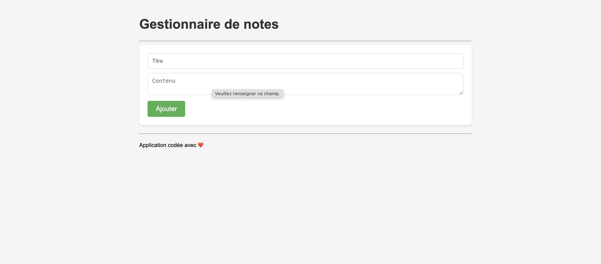

# Gestion de Notes 🎓



Application web simple de gestion de notes scolaires développée en PHP procédural avec PDO et SQLite.

**Démo en ligne :** [Voir la capture d'écran](#-captures-décran)

## 📋 Présentation

Cette application permet de gérer des notes avec les fonctionnalités suivantes :
- Ajouter une nouvelle note (titre + contenu)
- Afficher la liste de toutes les notes
- Supprimer une note
- Interface simple et intuitive

## 🛠️ Pré-requis

- PHP 7.0 ou supérieur
- Extension SQLite3 pour PHP
- Extension PDO pour PHP

## 📦 Installation

1. Cloner ou télécharger le projet dans votre dossier local
2. Ouvrir un terminal dans le dossier du projet
3. Créer la base de données SQLite en exécutant :
   ```bash
   sqlite3 database.sqlite < database.sql
   ```

## 🚀 Lancement

Démarrer le serveur PHP intégré :
```bash
php -S localhost:8000
```

Puis ouvrir votre navigateur à l'adresse : http://localhost:8000

## 📁 Structure du projet

```
gestion-notes/
├── index.php              # Point d'entrée principal
├── database.sql           # Script de création de la table
├── database.sqlite        # Base de données SQLite (créée après installation)
├── style.css             # Feuille de style
│
├── models/               # Couche modèle
│   ├── db.php           # Connexion à la base de données
│   └── noteModel.php    # Fonctions CRUD pour les notes
│
├── controllers/          # Couche contrôleur
│   └── noteController.php # Logique de traitement
│
└── views/                # Couche vue
    ├── header.php       # En-tête HTML
    ├── footer.php       # Pied de page HTML
    ├── form.php         # Formulaire d'ajout
    └── notes.php        # Affichage des notes
```

## 🔒 Sécurité

- Utilisation de requêtes préparées PDO
- Protection contre les injections SQL
- Échappement des données avec htmlspecialchars()

## 📤 Déploiement sur GitHub

1. Créez un nouveau repository sur GitHub nommé `gestion-notes`
2. Initialisez git dans le dossier du projet :
   ```bash
   git init
   git add .
   git commit -m "Initial commit - Application de gestion de notes"
   ```
3. Ajoutez le remote et poussez :
   ```bash
   git remote add origin https://github.com/VOTRE_USERNAME/gestion-notes.git
   git branch -M main
   git push -u origin main
   ```

## 👤 Auteur

Développé avec ❤️ pour le Training 2

## 📸 Captures d'écran

### Interface principale


L'application présente une interface claire avec :
- Un formulaire d'ajout de notes en haut
- La liste des notes en dessous
- Un bouton de suppression pour chaque note

### Fonctionnalités
- ✅ Interface simple et intuitive
- ✅ Ajout rapide de notes
- ✅ Affichage chronologique (plus récentes en premier)
- ✅ Suppression en un clic
